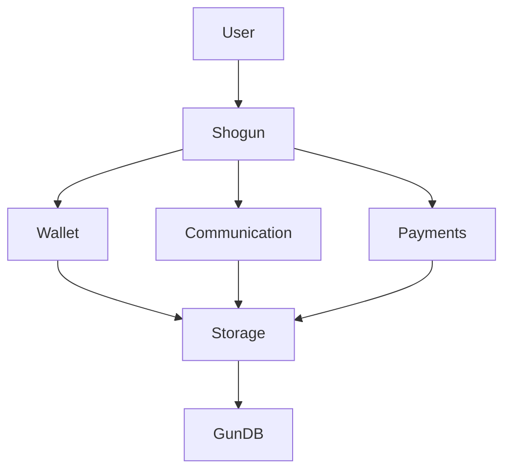

# SHOGUN - Decentralized Wallet Manager

A decentralized wallet manager that uses Gun.js to handle wallets and private keys directly in the browser. It provides a complete authentication and key management system with support for stealth addresses and ActivityPub integration.



[Broken link](broken-reference)


## ✨ Key Features

* 🔐 **Advanced Security**
  * Secure private key management with Web Crypto API
  * Stealth address support
  * End-to-end encryption
  * Secure entropy management
  * ActivityPub key management
  * HD wallet derivation
  * Off-chain payment channels
* 🌐 **Decentralization**
  * Distributed storage with Gun.js
  * P2P synchronization
  * No central server
  * ActivityPub federation support
  * Decentralized messaging
  * Stealth transactions
* 🔄 **Portability**
  * Complete data import/export
  * Encrypted backups
  * Multi-device support
  * Cross-platform compatibility
  * HD wallet recovery
* 💰 **Payment Features**
  * HD wallet management
  * Stealth addresses
  * Off-chain micropayments
  * Payment channels
  * Transaction privacy
* 💬 **Communication**
  * Decentralized chat
  * Private messaging
  * Group channels
  * Announcement channels
  * RSS integration

## 🛠️ Requirements

* Node.js >= 16.0.0
* npm >= 7.0.0
* Modern browser with Web Crypto API support
* For Node.js: crypto module support

## 🚀 Installation

```bash
npm install @scobru/shogun
```

## 📚 Quick Start

### Basic Usage

```typescript
import { Shogun } from '@scobru/shogun'

// Inizializza Shogun con la configurazione Gun
const shogun = new Shogun({
  peers: ['https://your-gun-peer.com/gun'],
  localStorage: false,
  radisk: false,
  multicast: false
}, APP_KEY_PAIR);

// Crea account
try {
  await shogun.createAccount('username', 'password');
} catch (error) {
  console.error('Account creation failed:', error);
}

// Login
const pubKey = await shogun.login('username', 'password');

// Crea HD wallet
const wallet = await shogun.createHDWallet();

console.log('Address:', wallet.address);
console.log('HD Path:', wallet.entropy);

// Crea stealth address
const stealthAddress = await shogun.generateStealthAddress(recipientPubKey);

// Configura canale di pagamento
const channel = await shogun.createPaymentChannel(relayAddress, deposit);

// Avvia chat
await shogun.joinChat('username', 'password', 'Display Name');
```

### Module-specific Examples

See individual module documentation for detailed examples:

* [JsonRpcConnector Examples](api/blockchain/connectors/jsonrpcconnector.md#examples)
* [EthereumHDKeyVault Examples](api/blockchain/wallets/ethereumhdkeyvault.md#examples)
* [StealthChain Examples](api/protocols/stealth/stealthchain.md#examples)
* [ActivityPub Examples](api/protocols/activity-pub/activitypub.md#examples)
* [UnstoppableChat Examples](api/protocols/messages/unstoppablechat.md#examples)
* [Micropayments Examples](api/protocols/micro-payments/micropayments.md#examples)

## 🔒 Security

### Key Management

* HD wallet support with BIP32/BIP39
* Stealth address generation
* Private key encryption
* Secure key derivation
* Multi-layer encryption

### Secure Storage

* Encrypted GunDB storage
* Distributed data storage
* No plain text private keys
* Secure key backup
* State verification

## 📦 Core Interfaces

```typescript
interface ShogunConfig {
  peers: string[];
  localStorage?: boolean;
  radisk?: boolean;
  multicast?: boolean;
  debug?: boolean;
}

interface WalletConfig {
  hdPath?: string;
  strength?: number;
  network?: string;
}

interface PaymentChannelConfig {
  challengePeriod: number;
  deposit: string;
  relay: string;
}

interface ChatConfig {
  superpeers: string[];
  encryption?: boolean;
  rssEnabled?: boolean;
}
```

## 🧪 Testing

```bash
# Run all tests
npm test

# Test specific modules
npm test -- --grep "Wallet"
npm test -- --grep "Micropayments"
npm test -- --grep "Chat"
```

## 💻 Compatibility

* **Browsers**:
  * Chrome >= 80
  * Firefox >= 78
  * Safari >= 14
  * Edge >= 80
  * Web Crypto API support required
* **Node.js**:
  * Version >= 16.0.0
  * crypto module support

## 🤝 Contributing

1. 🍴 Fork the repository
2. 🔧 Create feature branch
3. 💾 Commit changes
4. 🚀 Push branch
5. 📝 Create Pull Request

### Development Guidelines

* Follow TypeScript best practices
* Add unit tests for new features
* Update documentation
* Follow semantic versioning
* Add JSDoc comments

## 📄 License

[MIT](LICENSE/)

## 🗺️ Roadmap

### Version 1.x

* [x] Basic wallet management
* [x] HD wallet support
* [x] Stealth addresses
* [x] ActivityPub integration
* [x] Basic chat functionality

### Version 2.x

* [ ] Enhanced privacy features
* [ ] Improved chat capabilities
* [ ] Advanced payment channels
* [ ] Cross-chain support
* [ ] Enhanced security features

### Version 3.x

* [ ] DAO integration
* [ ] Smart contract templates
* [ ] Advanced federation
* [ ] AI-powered features
* [ ] Mobile optimization

## 🏗️ Architecture

### Core Components

```typescript
Shogun (Main Class)
├── Authentication
│   ├── WebAuthn
│   └── GunAuth
├── Wallet
│   ├── HDWallet
│   ├── StealthAddresses
│   └── JsonRpcConnector
├── Communication
│   ├── Chat
│   └── ActivityPub
├── Payments
│   ├── Micropayments
│   └── PaymentChannels
└── Storage
    └── GunStorage
```

### Data Flow



## 📱 Mobile Support

* React Native compatibility
* Mobile-optimized storage
* Biometric authentication
* Push notifications
* Offline support

## 🔧 Configuration

```typescript
const config = {
  // Gun.js configuration
  gun: {
    peers: ['https://peer1.com/gun', 'https://peer2.com/gun'],
    localStorage: false,
    radisk: true
  },
  
  // Wallet configuration
  wallet: {
    hdPath: "m/44'/60'/0'/0",
    network: 'mainnet',
    strength: 256
  },
  
  // Chat configuration
  chat: {
    encryption: true,
    rssEnabled: true,
    superpeers: ['https://superpeer1.com']
  },
  
  // Payment configuration
  payment: {
    challengePeriod: 86400,
    minDeposit: '0.1'
  }
};
```
