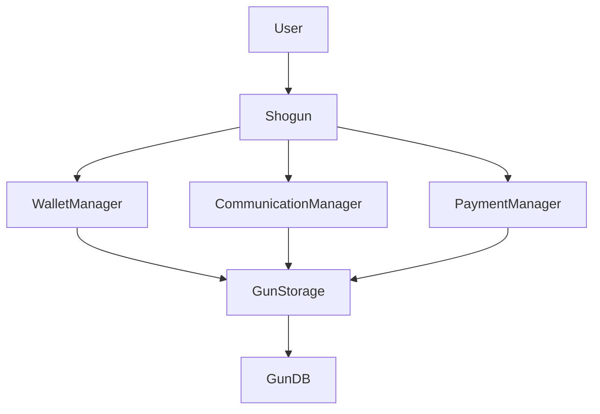

# SHOGUN - Decentralized Wallet Manager

A decentralized wallet manager that uses Gun.js to handle wallets and private keys directly in the browser. It provides a complete authentication and key management system with support for stealth addresses and ActivityPub integration.

## 📚 Documentation

- [JsonRpcConnector](docs/JsonRpcConnector.md) - Ethereum JSON-RPC integration
- [EthereumHDKeyVault](docs/EthereumHDKeyVault.md) - HD wallet management
- [StealthChain](docs/StealthChain.md) - Stealth address implementation
- [ActivityPub](docs/ActivityPub.md) - ActivityPub protocol integration
- [UnstoppableChat](docs/UnstoppableChat.md) - Decentralized messaging
- [GunStorage](docs/GunStorage.md) - Secure data storage
- [Micropayments](docs/Micropayments.md) - Off-chain payment channels

## ✨ Key Features

- 🔐 **Advanced Security**
  - Secure private key management with Web Crypto API
  - Stealth address support
  - End-to-end encryption
  - Secure entropy management
  - ActivityPub key management
  - HD wallet derivation
  - Off-chain payment channels

- 🌐 **Decentralization**
  - Distributed storage with Gun.js
  - P2P synchronization
  - No central server
  - ActivityPub federation support
  - Decentralized messaging
  - Stealth transactions

- 🔄 **Portability**
  - Complete data import/export
  - Encrypted backups
  - Multi-device support
  - Cross-platform compatibility
  - HD wallet recovery

- 💰 **Payment Features**
  - HD wallet management
  - Stealth addresses
  - Off-chain micropayments
  - Payment channels
  - Transaction privacy

- 💬 **Communication**
  - Decentralized chat
  - Private messaging
  - Group channels
  - Announcement channels
  - RSS integration

## 🛠️ Requirements

- Node.js >= 16.0.0
- npm >= 7.0.0
- Modern browser with Web Crypto API support
- For Node.js: crypto module support

## 🚀 Installation

```bash
npm install @scobru/shogun
```

## 📚 Quick Start

### Basic Usage

```typescript
import { Shogun } from '@scobru/shogun'

// Initialize Shogun with Gun configuration
const shogun = new Shogun({
  peers: ['https://your-gun-peer.com/gun'],
  localStorage: false,
  radisk: false,
  multicast: false
}, APP_KEY_PAIR);

// Get required managers and services
const walletManager = shogun.getWalletManager();
const webAuthnService = shogun.getWebAuthnService();
const activityPubManager = shogun.getActivityPubManager();
const micropaymentManager = shogun.getMicropaymentManager();
const chatManager = shogun.getChatManager();

// Create account
try {
  await walletManager.createAccount('username', 'password');
} catch (error) {
  console.error('Account creation failed:', error);
}

// Login
const pubKey = await walletManager.login('username', 'password');

// Create HD wallet
const hdVault = walletManager.getHDKeyVault();
const wallet = await hdVault.createAccount();

console.log('Address:', wallet.address);
console.log('HD Path:', wallet.entropy);

// Create stealth address
const stealth = walletManager.getStealthChain();
const stealthAddress = await stealth.generateStAdd(recipientPubKey);

// Setup payment channel
const payments = micropaymentManager.createChannel(relayAddress, deposit);

// Start chat
const chat = chatManager.createInstance();
await chat.join('username', 'password', 'Display Name');
```

### Module-specific Examples

See individual module documentation for detailed examples:
- [JsonRpcConnector Examples](docs/JsonRpcConnector.md#examples)
- [EthereumHDKeyVault Examples](docs/EthereumHDKeyVault.md#examples)
- [StealthChain Examples](docs/StealthChain.md#examples)
- [ActivityPub Examples](docs/ActivityPub.md#examples)
- [UnstoppableChat Examples](docs/UnstoppableChat.md#examples)
- [Micropayments Examples](docs/Micropayments.md#examples)

## 🔒 Security

### Key Management

- HD wallet support with BIP32/BIP39
- Stealth address generation
- Private key encryption
- Secure key derivation
- Multi-layer encryption

### Secure Storage

- Encrypted GunDB storage
- Distributed data storage
- No plain text private keys
- Secure key backup
- State verification

## 🐛 Debugging

Enable debug logs for different components:

```typescript
// Gun.js debugging
GUN_ENV=debug

// Shogun debugging
SHOGUN_DEBUG=true

// Component-specific debugging
WALLET_DEBUG=true
CHAT_DEBUG=true
MICROPAYMENT_DEBUG=true
```

## 📦 Core Interfaces

```typescript
interface ShogunConfig {
  peers: string[];
  localStorage?: boolean;
  radisk?: boolean;
  multicast?: boolean;
  debug?: boolean;
}

interface WalletConfig {
  hdPath?: string;
  strength?: number;
  network?: string;
}

interface PaymentChannelConfig {
  challengePeriod: number;
  deposit: string;
  relay: string;
}

interface ChatConfig {
  superpeers: string[];
  encryption?: boolean;
  rssEnabled?: boolean;
}
```

## 🧪 Testing

```bash
# Run all tests
npm test

# Test specific modules
npm test -- --grep "Wallet"
npm test -- --grep "Micropayments"
npm test -- --grep "Chat"
```

## 💻 Compatibility

- **Browsers**: 
  - Chrome >= 80
  - Firefox >= 78
  - Safari >= 14
  - Edge >= 80
  - Web Crypto API support required

- **Node.js**:
  - Version >= 16.0.0
  - crypto module support

## 🤝 Contributing

1. 🍴 Fork the repository
2. 🔧 Create feature branch
3. 💾 Commit changes
4. 🚀 Push branch
5. 📝 Create Pull Request

### Development Guidelines

- Follow TypeScript best practices
- Add unit tests for new features
- Update documentation
- Follow semantic versioning
- Add JSDoc comments

## 📄 License

[MIT](LICENSE)

## 🗺️ Roadmap

### Version 1.x
- [x] Basic wallet management
- [x] HD wallet support
- [x] Stealth addresses
- [x] ActivityPub integration
- [x] Basic chat functionality

### Version 2.x
- [ ] Enhanced privacy features
- [ ] Improved chat capabilities
- [ ] Advanced payment channels
- [ ] Cross-chain support
- [ ] Enhanced security features

### Version 3.x
- [ ] DAO integration
- [ ] Smart contract templates
- [ ] Advanced federation
- [ ] AI-powered features
- [ ] Mobile optimization

## 🏗️ Architecture

### Core Components

```typescript
Shogun (Main Class)
├── WalletManager
│   ├── EthereumHDKeyVault
│   ├── StealthChain
│   └── JsonRpcConnector
├── CommunicationManager
│   ├── UnstoppableChat
│   └── ActivityPub
├── PaymentManager
│   ├── MicropaymentAPI
│   └── PaymentChannel
└── StorageManager
    └── GunStorage
```

### Data Flow



## 📱 Mobile Support

- React Native compatibility
- Mobile-optimized storage
- Biometric authentication
- Push notifications
- Offline support

## 🔧 Configuration

```typescript
const config = {
  // Gun.js configuration
  gun: {
    peers: ['https://peer1.com/gun', 'https://peer2.com/gun'],
    localStorage: false,
    radisk: true
  },
  
  // Wallet configuration
  wallet: {
    hdPath: "m/44'/60'/0'/0",
    network: 'mainnet',
    strength: 256
  },
  
  // Chat configuration
  chat: {
    encryption: true,
    rssEnabled: true,
    superpeers: ['https://superpeer1.com']
  },
  
  // Payment configuration
  payment: {
    challengePeriod: 86400,
    minDeposit: '0.1'
  }
};
```
